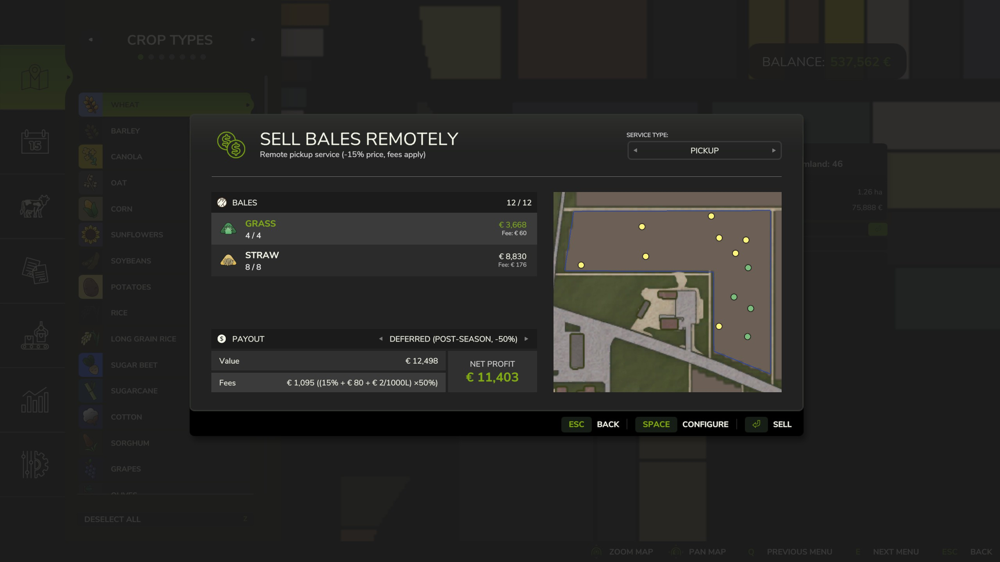
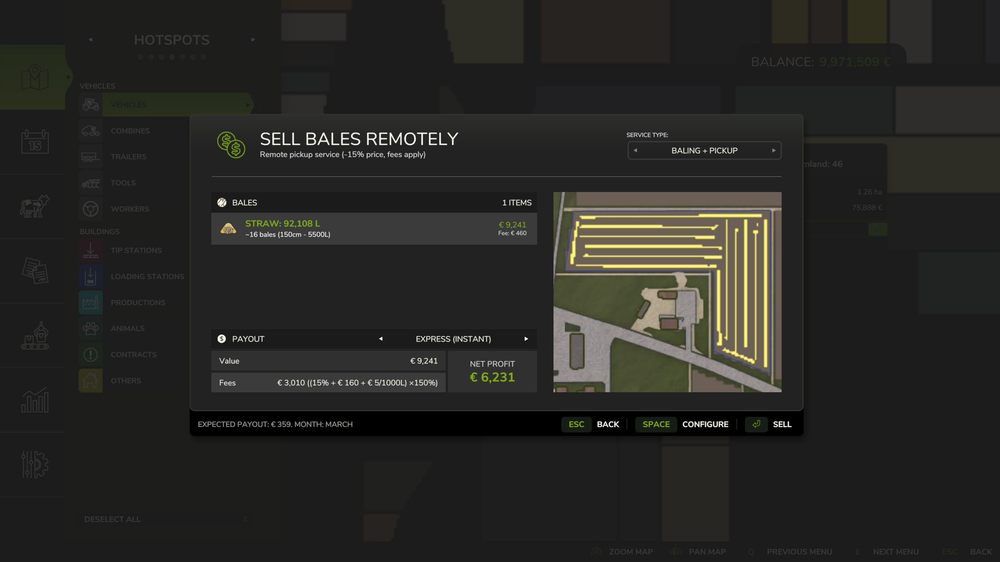
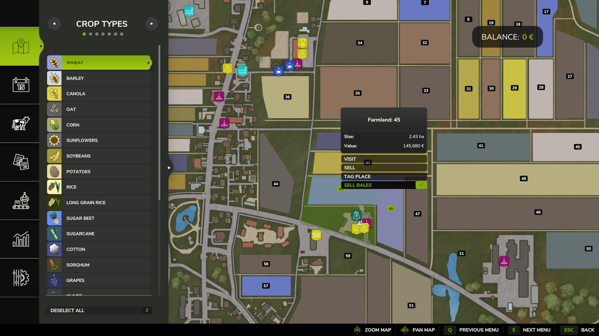
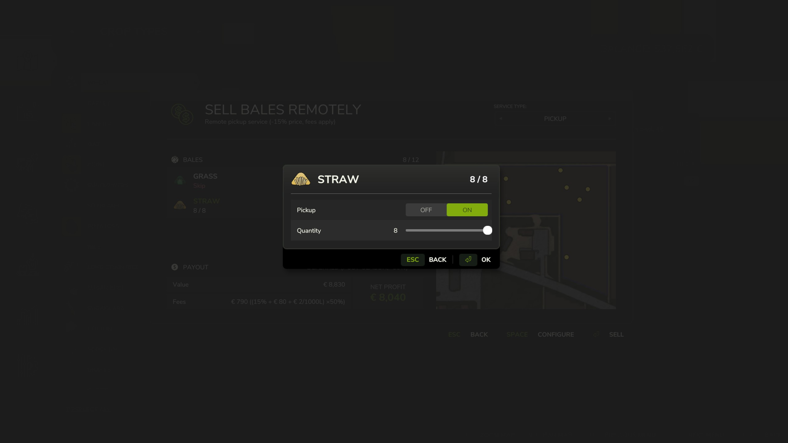
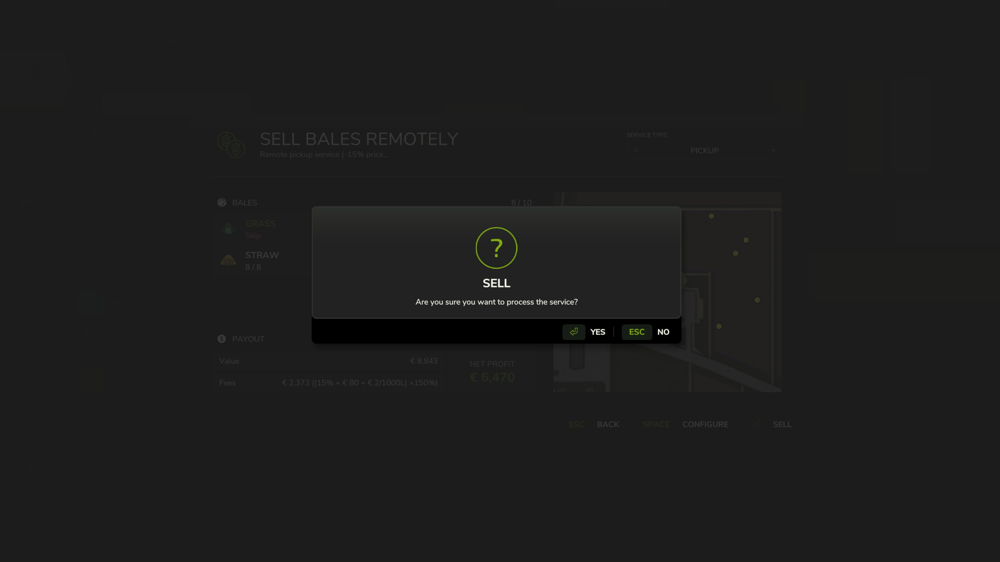

   
  <b>Bale Direct</b> allows you to sell bales remotely from the map menu &mdash;
   
  easily manage your sales without driving to a selling point by using the remote pickup service directly from your owned fields.
   
   

## Installation

1. Download the latest version of the mod from the [Releases](https://github.com/modnext/baleDirect/releases/) page.
2. Copy the downloaded `.zip` file to your Farming Simulator mods folder:
   - Windows: `Documents\My Games\FarmingSimulator2025\mods\`
   - macOS: `~/Library/Application Support/FarmingSimulator2025/mods/`
   - Linux: `~/FarmingSimulator2025/mods/`
3. Start Farming Simulator 2025 and enable the mod in the Mods menu.

## How to use

- Select an owned farmland with bales on the map to see the "Sell Bales" button.
- Choose service type (Pickup or Baling + Pickup), configure items and payout method, then confirm the sale.

Features include per-item configuration, service mode selection, express or deferred payout options, difficulty-scaled economy with fees, and full multiplayer support.

## Screenshots

## License

Distributed under the GPL-3.0 license. See [LICENSE](https://github.com/modnext/baleDirect/blob/main/LICENSE) for more information.
